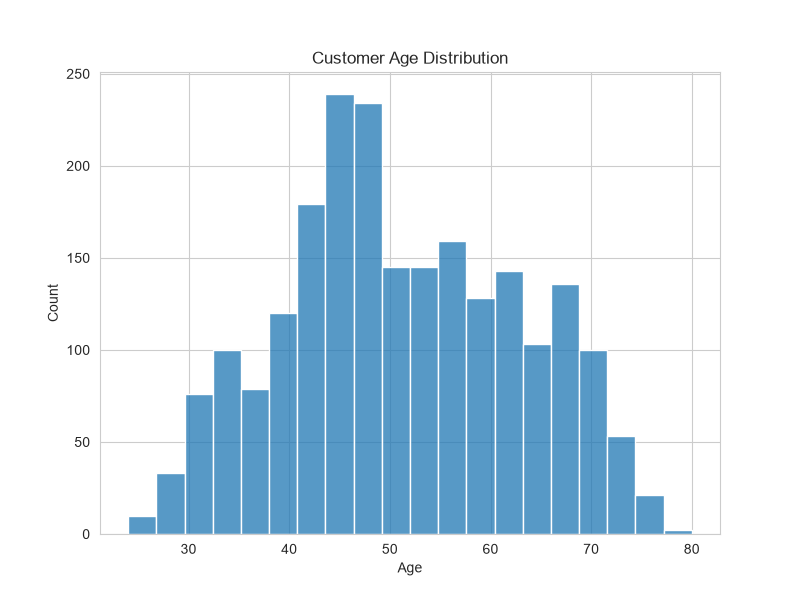
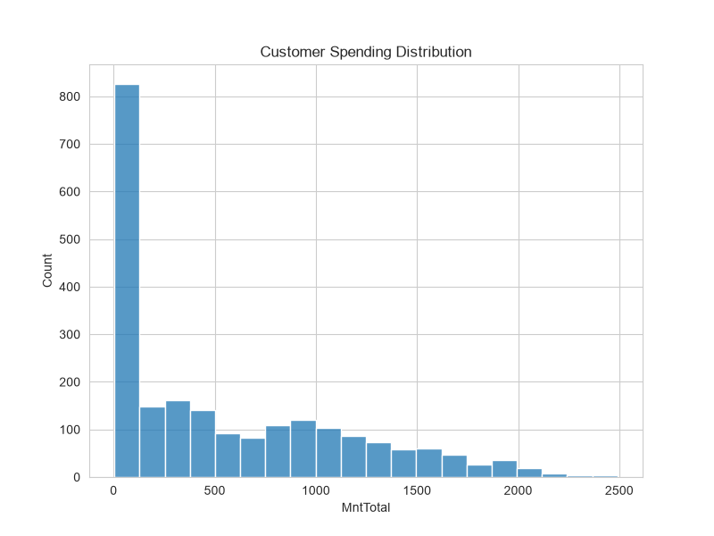
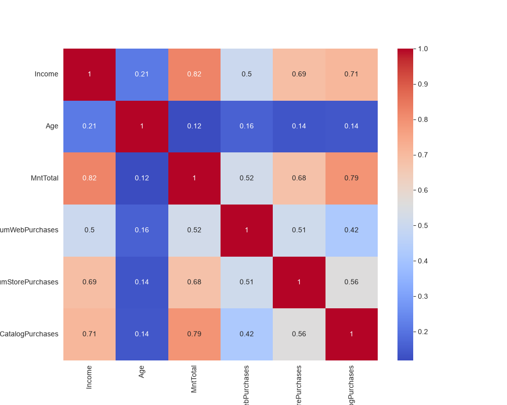
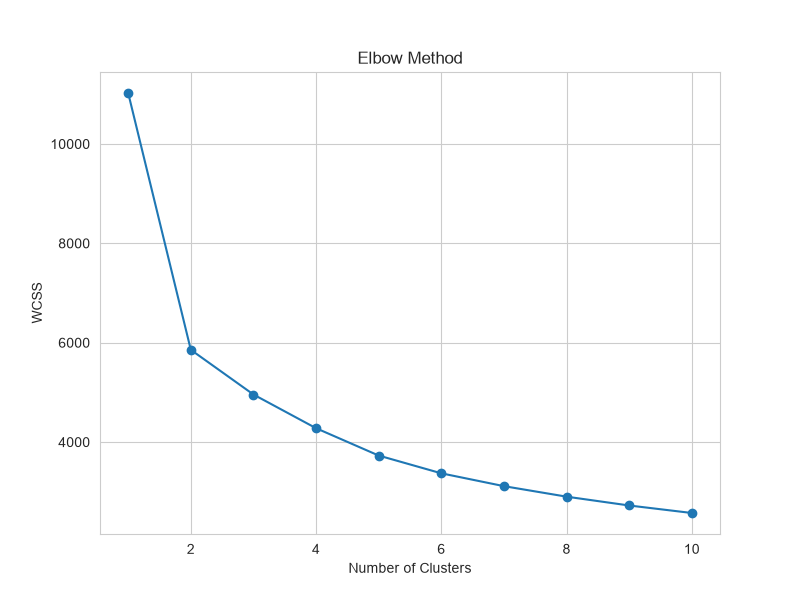
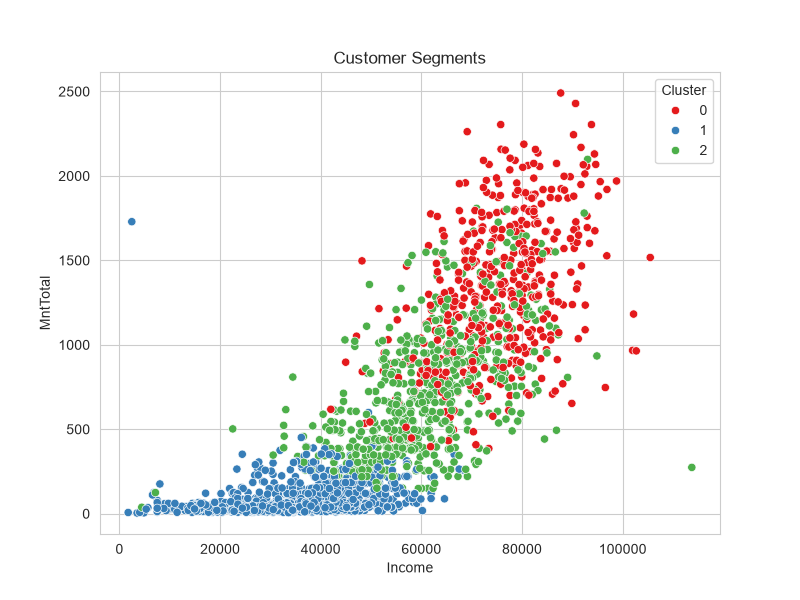
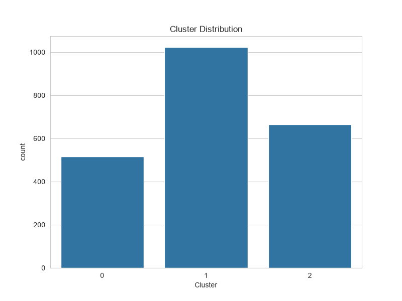
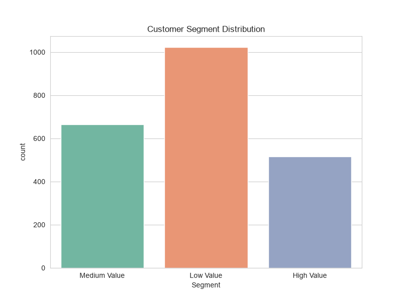
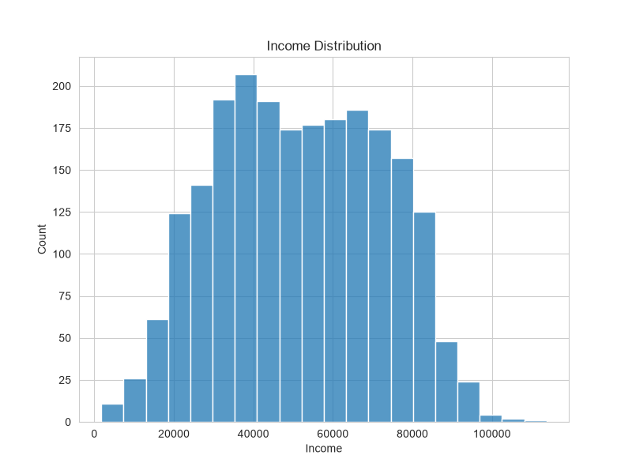
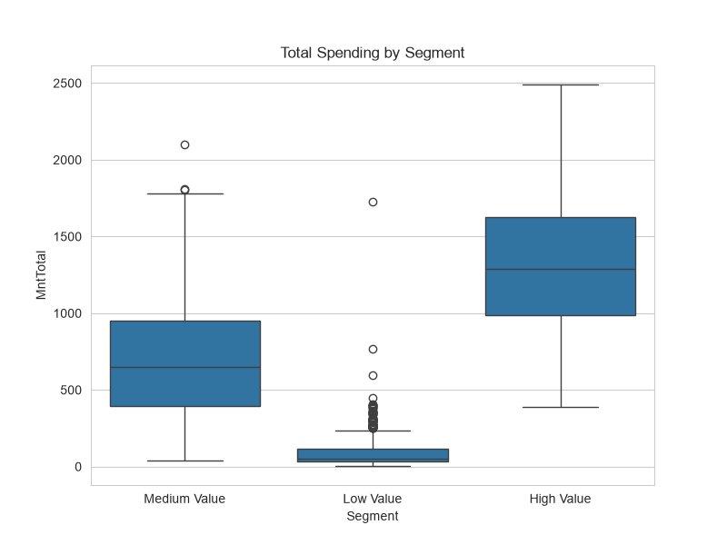
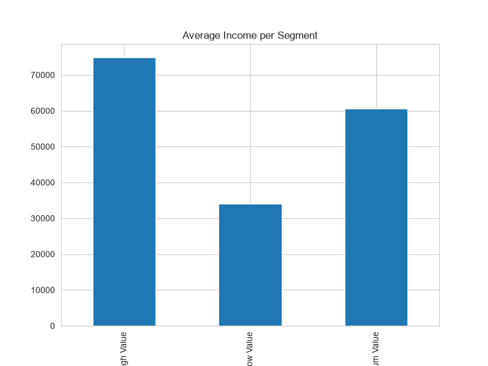

# Customer Segmentation Analysis
# Customer Segmentation Analysis


## 📌 Objective

Perform customer segmentation analysis for an e-commerce company using clustering techniques to group customers based on purchasing behavior and spending patterns. These insights help businesses design targeted marketing strategies and improve customer satisfaction.

---

## 📂 Dataset

Dataset: iFood Customer Data

Rows: 2205

Columns: 39

Features include:

* Income
* Age
* Purchase Amount
* Web Purchases
* Store Purchases
* Catalog Purchases
* Customer Response
* Campaign Acceptance

---

## 🛠 Technologies Used

* Python
* Pandas
* NumPy
* Matplotlib
* Seaborn
* Scikit-learn

---

## 📊 Exploratory Data Analysis

* Dataset Exploration
* Missing Value Analysis
* Duplicate Removal
* Descriptive Statistics
* Customer Behavior Analysis

---

## 🤖 Machine Learning Technique

### K-Means Clustering

Feature Selection:

* Income
* Age
* MntTotal
* NumWebPurchases
* NumStorePurchases

### Data Preprocessing

* StandardScaler

### Cluster Optimization

* Elbow Method

### Number of Clusters Selected

K = 3

---

# 📈 Visualizations

### Customer Age Distribution



### Customer Spending Distribution



### Correlation Heatmap



### Elbow Method



### Customer Clusters



### Cluster Distribution



### Customer Segment Distribution



### Income Distribution



### Spending by Segment



### Segment Income Analysis




---

## 👥 Customer Segments

### ⭐ High Value Customers

* High income
* High spending
* Frequent purchases

### 🟢 Medium Value Customers

* Moderate spending
* Growth potential

### 🔵 Low Value Customers

* Low spending
* Suitable for promotional campaigns

---

## 💡 Business Recommendations

### High Value Customers

* Loyalty rewards
* Premium memberships
* Personalized recommendations

### Medium Value Customers

* Bundle offers
* Email marketing campaigns

### Low Value Customers

* Discount coupons
* Promotional campaigns
* Social media engagement

---

## 📁 Project Structure

kalyanreddy_task02

├── customer_segmentation.py

├── requirements.txt

├── README.md

├── ifood_df.csv

└── outputs/

```
├── customer_age_distribution.png

├── customer_spending_distribution.png

├── correlation_heatmap.png

├── elbow_method.png

├── customer_clusters.png

├── cluster_distribution.png

├── customer_segment_distribution.png

├── income_distribution.png

├── spending_by_segment.png

├── segment_income.png

└── customer_cluster_profiles.csv
```

---

## 🎯 Outcome

Successfully segmented customers into three groups using K-Means clustering and generated business insights to support targeted marketing strategies.
