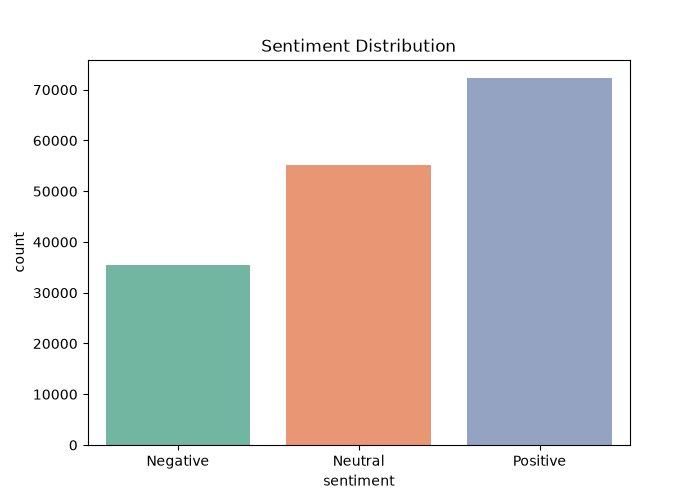
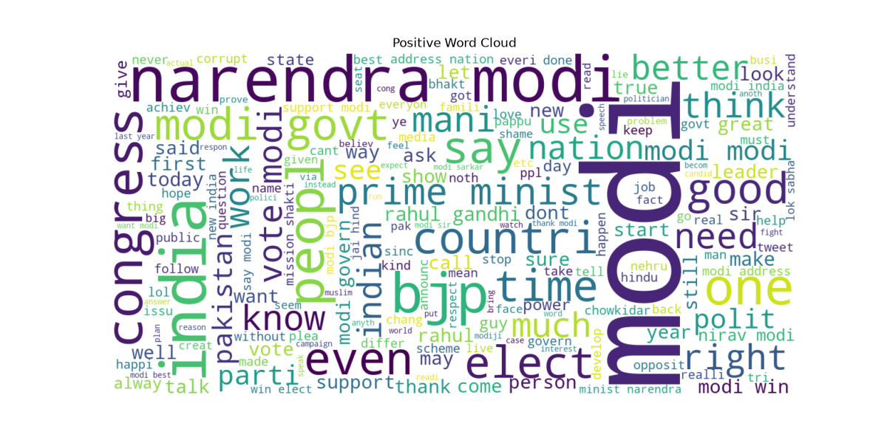
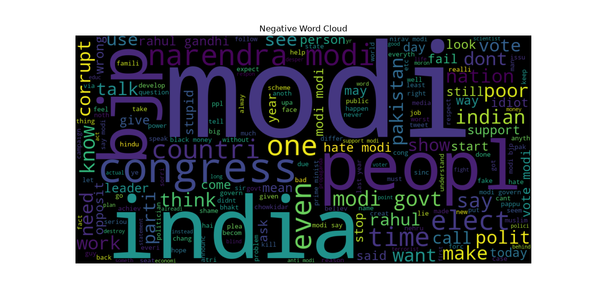
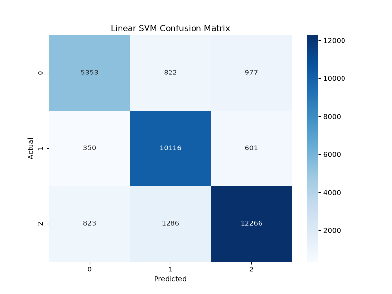
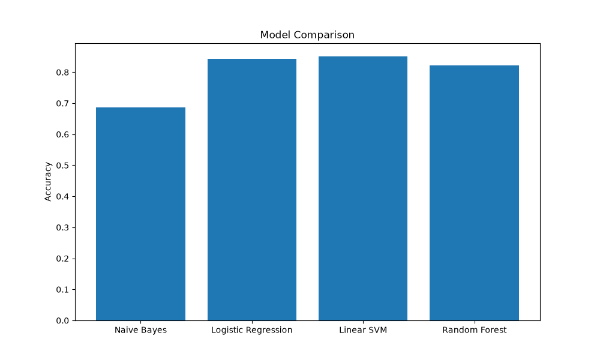

# 🧠 Sentiment Analysis using NLP and Machine Learning


## 📌 Project Overview

This project focuses on **Sentiment Analysis** using Natural Language Processing (NLP) and Machine Learning techniques. The goal is to classify text into **Positive**, **Neutral**, and **Negative** sentiments by analyzing social media tweets.

The project covers the complete machine learning pipeline, including:

* Data Exploration and Cleaning
* Text Preprocessing
* Feature Engineering using TF-IDF
* Model Training and Evaluation
* Data Visualization
* Business Insights and Recommendations

---

## 🎯 Objectives

* Understand sentiment patterns in text data.
* Apply NLP techniques for text preprocessing.
* Train multiple machine learning models.
* Compare model performances.
* Extract business insights from sentiment trends.

---

## 📂 Dataset Information

The dataset used in this project is not included in this repository due to its large size.

### Dataset Source

* **Twitter Sentiment Dataset**
* Source: Kaggle
* Link: https://www.kaggle.com/datasets/saurabhshahane/twitter-sentiment-dataset

### Dataset File

```text
Twitter_Data.csv
```

After downloading the dataset, place it inside:

```text
kalyanreddy_task08/
```

before running:
python sentiment_analysis.py


**Features**

* `clean_text` → Tweet text
* `category`

  * `-1` → Negative
  * `0` → Neutral
  * `1` → Positive

Dataset Size:

* Total Records: **162,980**

---

# ⚙️ Technologies Used

* Python
* Pandas
* NumPy
* Matplotlib
* Seaborn
* NLTK
* WordCloud
* Scikit-Learn

---

# 🔄 Project Workflow

```text
Dataset
   ↓
Data Cleaning
   ↓
Text Preprocessing
   ↓
TF-IDF Vectorization
   ↓
Train-Test Split
   ↓
Machine Learning Models
   ↓
Performance Evaluation
   ↓
Visualization
   ↓
Business Insights
```

---

# 🧹 Text Preprocessing

The following NLP techniques were applied:

* Lowercase conversion
* Removal of punctuation and numbers
* Tokenization
* Stopword removal
* Stemming using Porter Stemmer

---

# 🤖 Machine Learning Models

The following models were trained and evaluated:

### 1️⃣ Multinomial Naive Bayes

* Accuracy: **68.69%**

### 2️⃣ Logistic Regression

* Accuracy: **84.35%**

### 3️⃣ Linear SVM ⭐ (Best Model)

* Accuracy: **85.09%**
* F1 Score: **85.01%**

### 4️⃣ Random Forest

* Accuracy: **82.24%**

---

# 📊 Visualizations

## Sentiment Distribution



---

## Positive Word Cloud



---

## Negative Word Cloud



---

## Linear SVM Confusion Matrix



---

## Model Comparison



---

# 📈 Performance Comparison

| Model                   | Accuracy   |
| ----------------------- | ---------- |
| Multinomial Naive Bayes | 68.69%     |
| Logistic Regression     | 84.35%     |
| ⭐ Linear SVM            | **85.09%** |
| Random Forest           | 82.24%     |

---

# 💡 Business Insights

* Positive sentiment dominates social media discussions.
* Negative tweets reveal dissatisfaction and concerns.
* Linear SVM achieved the highest performance.
* NLP techniques effectively classify sentiments from text.
* Automated sentiment analysis can help monitor public opinion in real time.

---

# 🚀 Recommendations

* Deploy Linear SVM for production use.
* Monitor customer feedback continuously.
* Focus on negative sentiment tweets to improve products and services.
* Retrain models periodically using fresh data.
* Integrate sentiment analytics into dashboards and reporting systems.

---

# 📁 Project Structure

```text
kalyanreddy_task08
│
├── sentiment_analysis.py
├── requirements.txt
├── README.md
├── Twitter_Data.csv
│
└── outputs
    ├── sentiment_distribution.png
    ├── wordcloud_positive.png
    ├── wordcloud_negative.png
    ├── confusion_matrix_svm.png
    └── model_comparison.png
```

---

# 🏆 Key Learning Outcomes

✔ Natural Language Processing (NLP)

✔ Text Cleaning and Preprocessing

✔ Feature Engineering using TF-IDF

✔ Machine Learning Model Building

✔ Model Evaluation and Comparison

✔ Data Visualization

✔ Business Insight Generation

---

## 👨‍💻 Author

**Byreddy Kalyan Reddy**

B.Tech CSE (AI & DS)

Swami Vivekanandha Institute of Technology

GitHub: https://github.com/kalyan-ds

LinkedIn: https://www.linkedin.com/in/kalyan-reddy-byreddy-559b6b344
