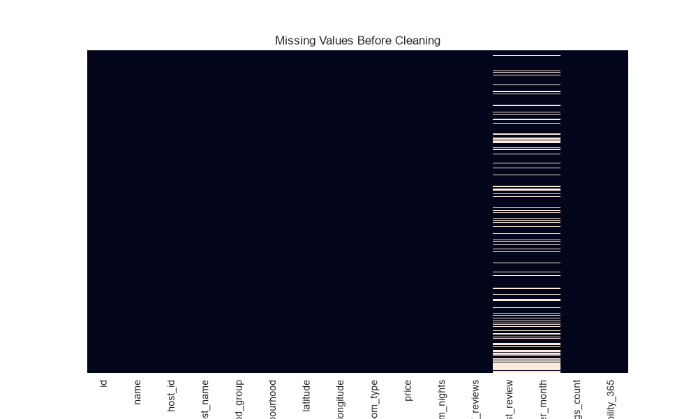
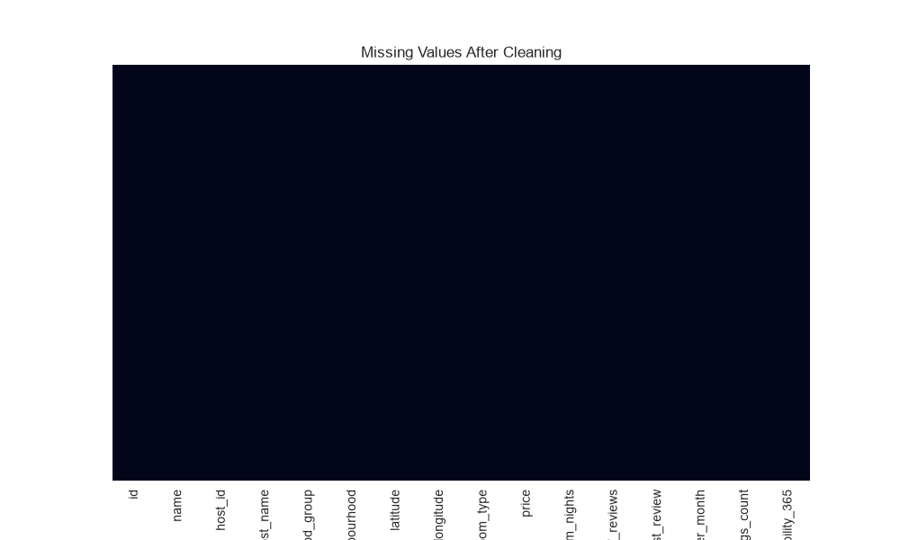
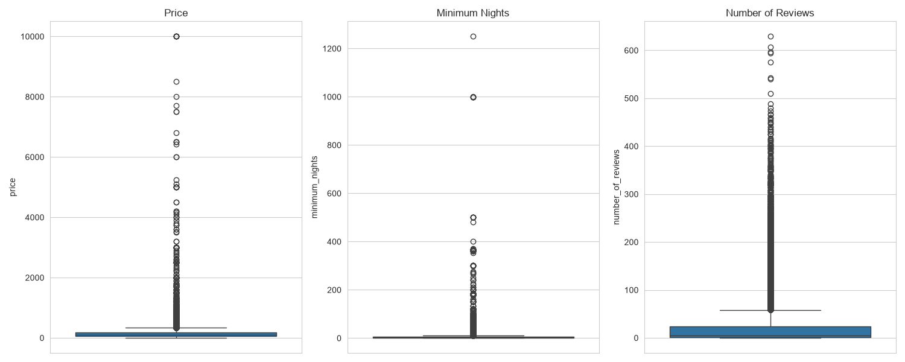
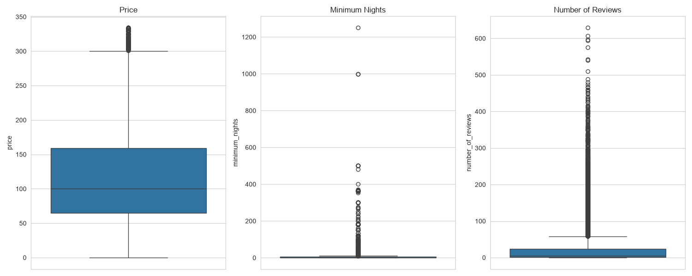
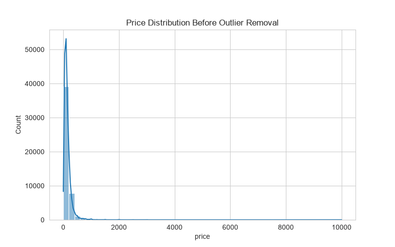
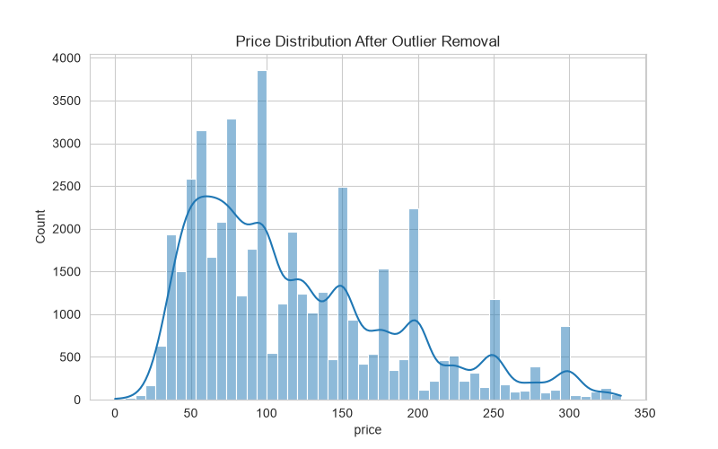
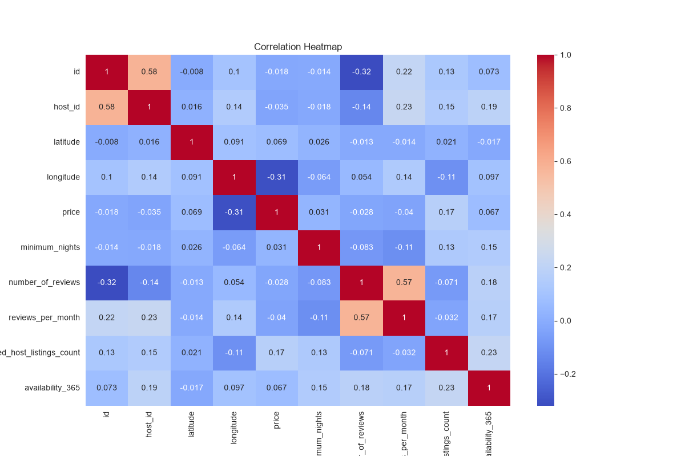
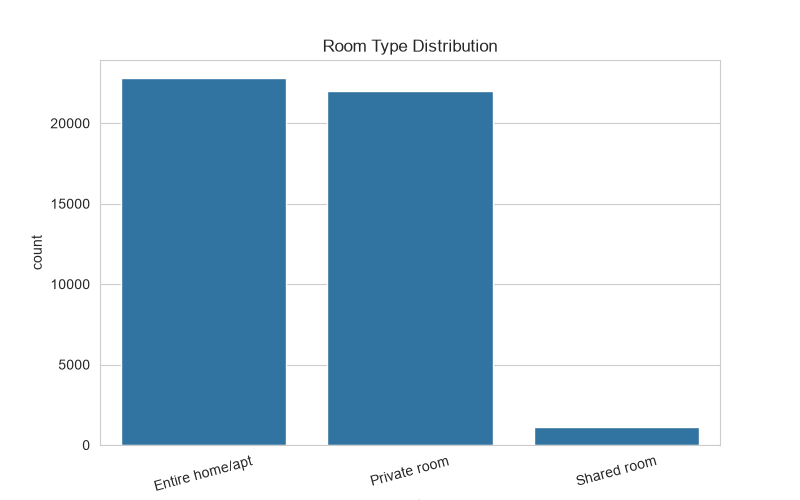
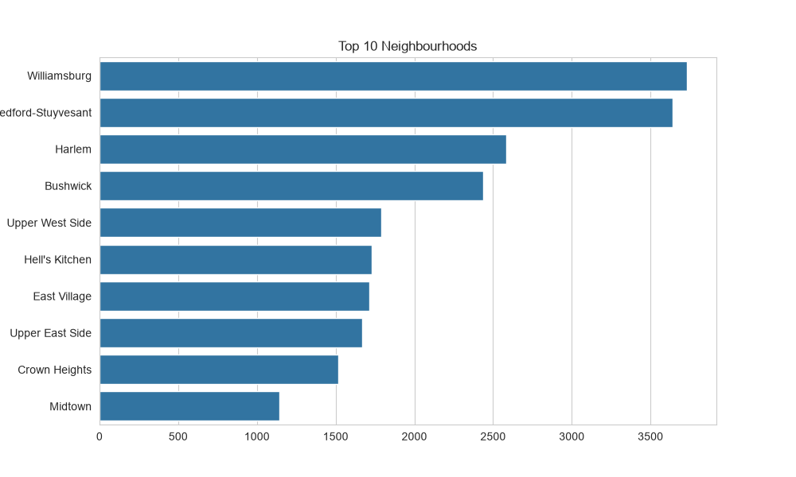

# 🧹 Data Cleaning and Preprocessing using Python

<p align="center">


</p>

---

# 📌 Project Overview

Data cleaning is one of the most important stages in the data analysis pipeline. Poor-quality data leads to inaccurate insights and unreliable machine learning models.

This project demonstrates a complete data preprocessing workflow on the **New York City Airbnb Open Dataset**, including:

✔ Missing Value Handling  
✔ Duplicate Removal  
✔ Outlier Detection and Removal  
✔ Feature Standardization  
✔ Data Integrity Validation  
✔ Data Visualization  
✔ Exporting a Clean Dataset

---

# 🎯 Objectives

- Improve data quality and consistency.
- Handle missing values intelligently.
- Detect and remove outliers using the IQR method.
- Standardize numerical features.
- Create meaningful visualizations.
- Export a cleaned dataset for downstream analysis.

---

# 📂 Dataset Information

### Dataset Used

**New York City Airbnb Open Data (AB_NYC_2019.csv)**

Dataset contains information about:

- Hosts
- Room Types
- Prices
- Availability
- Reviews
- Neighborhood Groups
- Geographic Coordinates

---

# 🛠 Technologies Used

| Category | Tools |
|------------|------|
| Programming Language | Python |
| Data Manipulation | Pandas, NumPy |
| Visualization | Matplotlib, Seaborn |
| Preprocessing | Scikit-Learn |
| IDE | VS Code |

---

# ⚙ Data Cleaning Pipeline

```text
Raw Dataset
     ↓
Missing Value Handling
     ↓
Duplicate Removal
     ↓
Outlier Detection (IQR)
     ↓
Feature Standardization
     ↓
Visualization
     ↓
Clean Dataset Export
```

---

# 🔍 Missing Value Handling

Handled missing values in:

- name
- host_name
- last_review
- reviews_per_month

### Missing Values Before Cleaning



### Missing Values After Cleaning



---

# 📊 Outlier Detection

Outliers were identified using the **Interquartile Range (IQR)** method.

### Before Outlier Removal



### After Outlier Removal



---

# 📈 Price Distribution

### Before Cleaning



### After Cleaning



---

# 🔥 Correlation Heatmap

Understanding relationships among numerical features.



---

# 🏠 Room Type Distribution



---

# 🌆 Top Neighbourhood Distribution



---

# ⚡ Feature Standardization

StandardScaler was applied on:

- Price
- Minimum Nights
- Number of Reviews
- Reviews per Month
- Availability 365

This ensures features are on the same scale for machine learning applications.

---

# 📁 Project Structure

```text
kalyanreddy_task04
│
├── data_cleaning.py
├── README.md
├── requirements.txt
│
└── outputs
    ├── missing_values_before.png
    ├── missing_values_after.png
    ├── outlier_boxplot_before.png
    ├── outlier_boxplot_after.png
    ├── price_distribution_before.png
    ├── price_distribution_after.png
    ├── correlation_heatmap.png
    ├── room_type_distribution.png
    ├── neighbourhood_distribution.png
```

---

# 📈 Results

✅ Successfully handled missing values

✅ No duplicate records found

✅ Removed outliers using IQR

✅ Standardized important numerical features

✅ Generated visual insights

✅ Exported a cleaned dataset for future analysis

---

# 🚀 Key Learnings

- Data Integrity
- Missing Value Imputation
- Duplicate Detection
- Outlier Treatment
- Feature Scaling
- Data Visualization
- Exploratory Data Analysis
- Dataset Preparation for Machine Learning

---

# 🔮 Future Improvements

- Automated Data Cleaning Pipeline
- Advanced Anomaly Detection
- Feature Engineering
- Interactive Dashboard using Power BI
- Data Validation Framework

---

# 📦 Requirements

```txt
pandas
numpy
matplotlib
seaborn
scikit-learn
```

---

# 👨‍💻 Author

## Byreddy Kalyan Reddy

🎓 B.Tech CSE (AI & DS)  
🏫 Swami Vivekanandha Institute of Technology  
💻 Aspiring Data Scientist | AI Engineer | ML Enthusiast

### Connect With Me

- GitHub: https://github.com/kalyan-ds
- LinkedIn: https://www.linkedin.com/in/kalyan-reddy-byreddy-559b6b344

---

⭐ If you found this project useful, please consider giving it a star!
