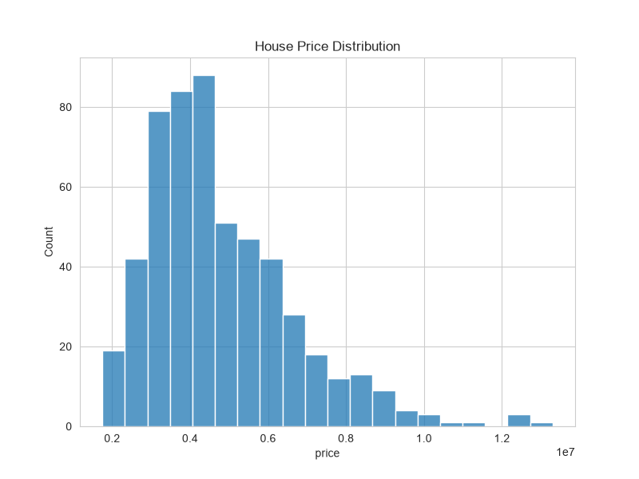
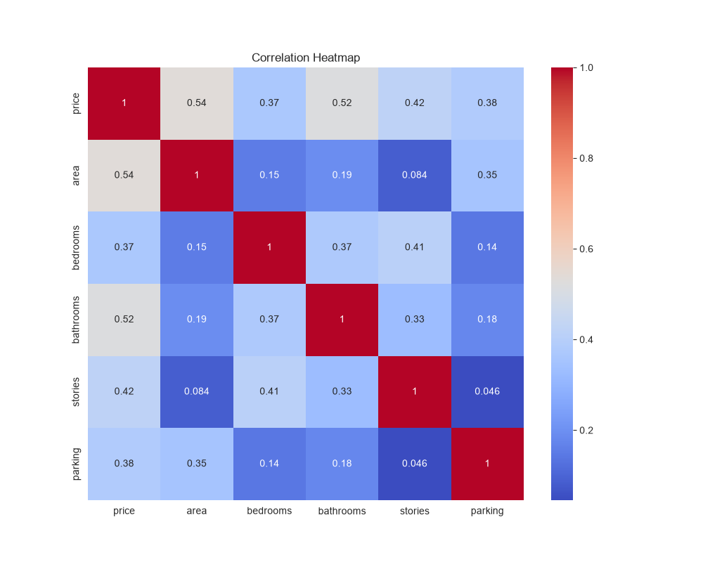
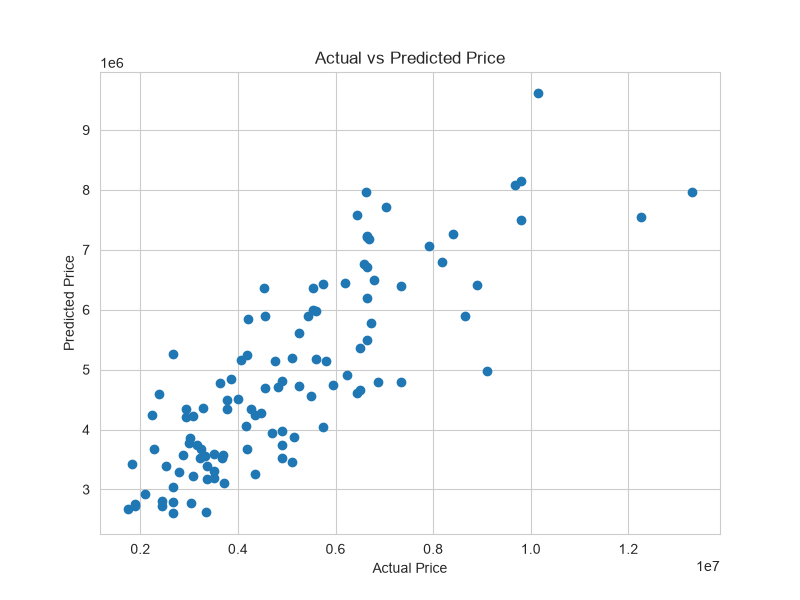
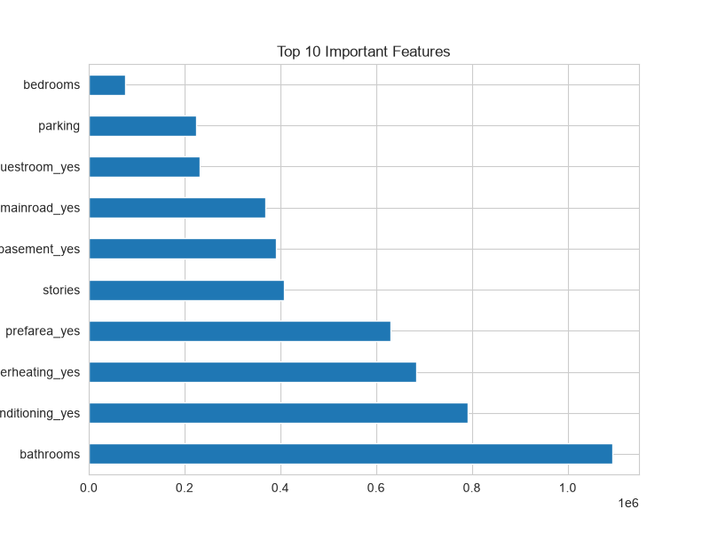
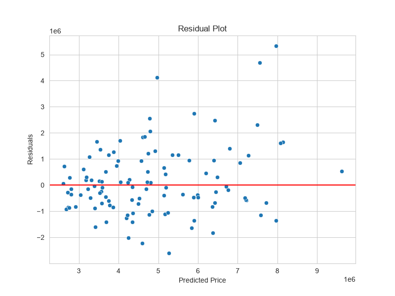

# Oasis Infobyte Data Analytics Internship - Task 5

### Predicting House Prices with Linear Regression
# 🏠 Predicting House Prices with Linear Regression


## 📌 Project Overview

This project aims to predict house prices using **Linear Regression**, one of the fundamental machine learning algorithms. By analyzing property features such as area, number of bedrooms, bathrooms, parking availability, furnishing status, and other amenities, the model estimates house prices and provides insights into factors influencing property values.

---

## 🎯 Objectives

- Perform data exploration and cleaning.
- Identify important features affecting house prices.
- Build a Linear Regression model.
- Evaluate model performance using regression metrics.
- Visualize relationships between actual and predicted values.
- Derive business insights and recommendations.

---

## 📂 Dataset Information

- **Dataset Name:** Housing Dataset
- **Rows:** 545
- **Columns:** 13
- **Target Variable:** `price`

### Features

- area
- bedrooms
- bathrooms
- stories
- mainroad
- guestroom
- basement
- hotwaterheating
- airconditioning
- parking
- prefarea
- furnishingstatus

---

## 🛠 Technologies Used

- Python
- Pandas
- NumPy
- Matplotlib
- Seaborn
- Scikit-Learn

---

## 🔍 Data Preprocessing

- Data exploration
- Missing value analysis
- Duplicate value checking
- Descriptive statistics
- Categorical variable encoding
- Feature selection
- Train-test split

---

## 🤖 Machine Learning Model

### Linear Regression

The Linear Regression model was trained to predict house prices based on various housing features.

---

## 📈 Model Performance

| Metric | Value |
|----------|--------|
| Mean Absolute Error (MAE) | 970,043 |
| Mean Squared Error (MSE) | 1.75 × 10¹² |
| Root Mean Squared Error (RMSE) | 1,324,506 |
| R² Score | 0.653 |

---

# 📊 Visualizations

## House Price Distribution



---

## Correlation Heatmap



---

## Actual vs Predicted Prices



---

## Feature Importance



---

## Residual Plot



---

# 💡 Business Insights

- House area significantly impacts house prices.
- Air conditioning and parking facilities increase property value.
- Furnishing status contributes to pricing.
- Houses located near main roads are more valuable.
- Properties with more bathrooms and stories command higher prices.

---

# 📋 Recommendations

- Focus on larger properties for premium pricing.
- Include air conditioning and parking spaces to maximize value.
- Furnished houses can attract higher prices.
- Properties with better accessibility tend to perform better in the market.

---

# 📁 Project Structure

```text
kalyanreddy_task05
│
├── Housing.csv
├── house_price_prediction.py
├── requirements.txt
├── README.md
└── outputs
    ├── price_distribution.png
    ├── correlation_heatmap.png
    ├── actual_vs_predicted.png
    ├── feature_importance.png
    └── residual_plot.png
```

---

# 🚀 Outcome

Successfully developed a Linear Regression model capable of predicting house prices with an R² score of **65.3%**, providing meaningful insights into the factors influencing real estate pricing.

---

## 👨‍💻 Author

**Byreddy Kalyan Reddy**

B.Tech CSE (AI & DS)

Swami Vivekanandha Institute of Technology

GitHub: https://github.com/kalyan-ds

LinkedIn: https://www.linkedin.com/in/kalyan-reddy-byreddy-559b6b344/