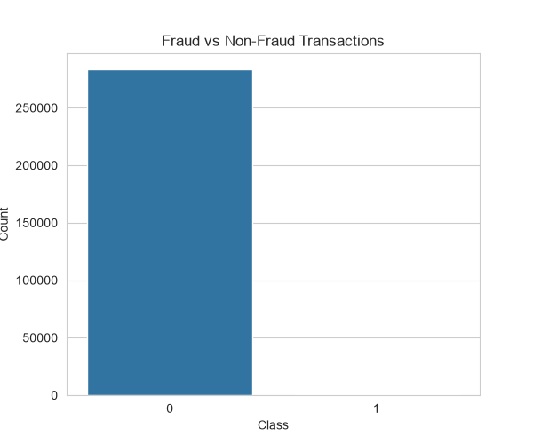
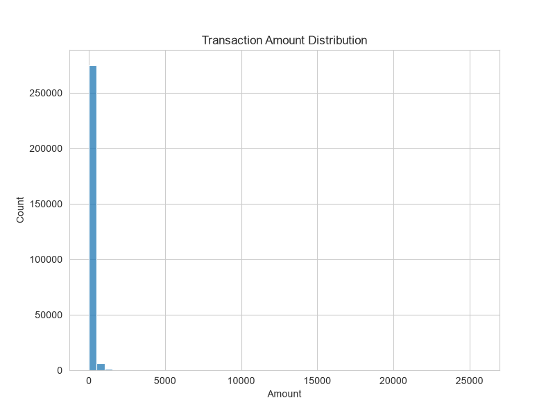
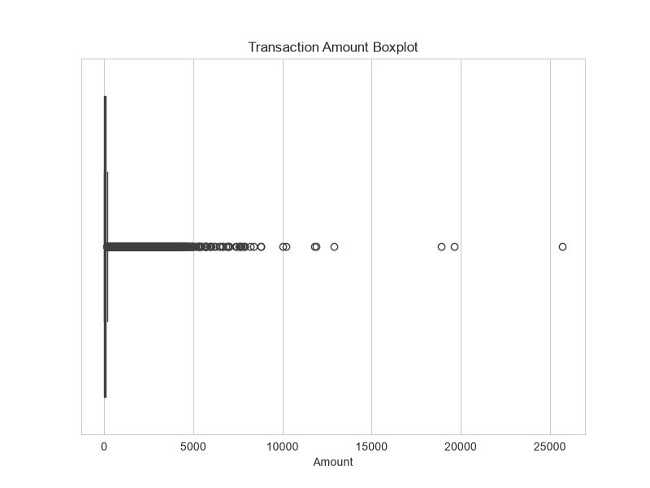
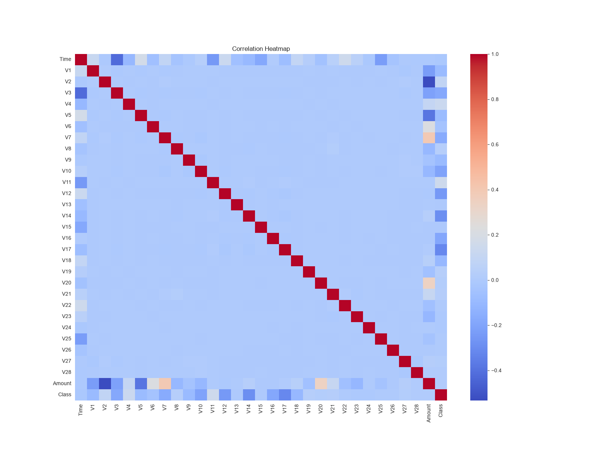
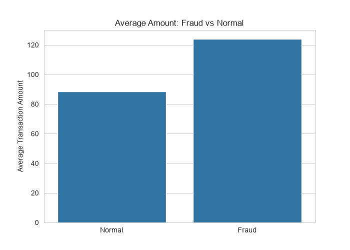
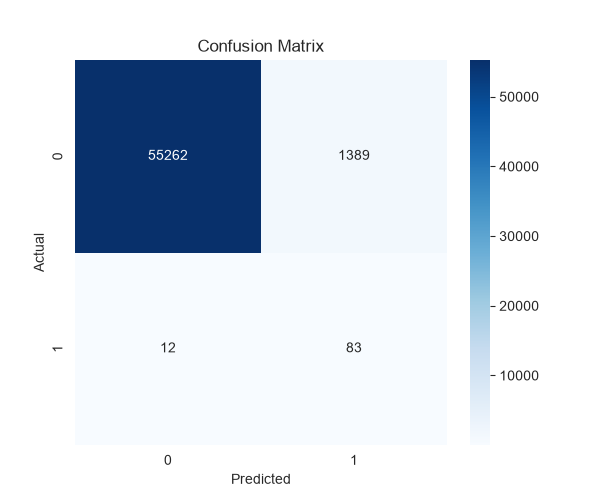
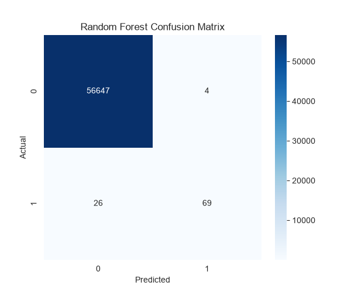
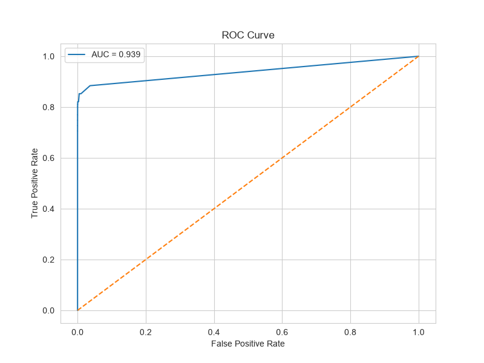
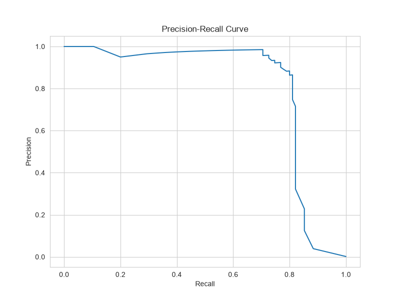
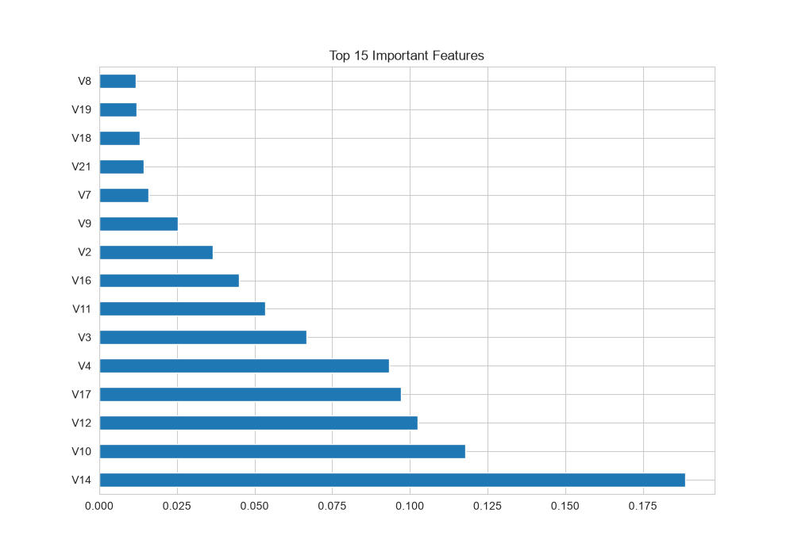

# 💳 Credit Card Fraud Detection using Machine Learning


---

# 📌 Project Overview

Fraud detection plays a critical role in modern financial systems. This project leverages machine learning techniques to identify fraudulent credit card transactions by analyzing transaction patterns and distinguishing between legitimate and suspicious activities.

The project explores multiple machine learning models and compares their performance using metrics suitable for highly imbalanced datasets.

---

# 🎯 Objectives

* Detect fraudulent transactions effectively.
* Perform exploratory data analysis and feature engineering.
* Handle highly imbalanced transaction data.
* Compare multiple machine learning models.
* Evaluate models using Precision, Recall and F1-score.
* Apply anomaly detection techniques.
* Simulate real-time fraud prediction.

---

# 📂 Dataset Information

### Dataset


This project uses the Credit Card Fraud Detection Dataset from Kaggle.

### Dataset Source

https://www.kaggle.com/datasets/mlg-ulb/creditcardfraud

### Note

The dataset file (`creditcard.csv`) is not included in this repository due to GitHub file size limitations.

Please download the dataset from Kaggle and place it inside the project directory before running the project.


### Shape

* Rows: **284,807**
* Columns: **31**

### After Removing Duplicates

* Rows: **283,726**

### Target Variable

| Class | Meaning                |
| ----- | ---------------------- |
| 0     | Legitimate Transaction |
| 1     | Fraudulent Transaction |

---

# 🛠️ Technologies Used

* Python
* Pandas
* NumPy
* Matplotlib
* Seaborn
* Scikit-Learn

---

# 🔍 Exploratory Data Analysis

Performed:

✔ Missing Value Analysis

✔ Duplicate Removal

✔ Descriptive Statistics

✔ Class Distribution Analysis

✔ Transaction Amount Distribution

✔ Boxplots

✔ Correlation Analysis

---

# 📊 Visualizations

## Class Distribution



---

## Transaction Amount Distribution



---

## Transaction Amount Boxplot



---

## Correlation Heatmap



---

## Fraud vs Normal Transaction Amount



---

## Confusion Matrix



---

## Random Forest Confusion Matrix



---

## ROC Curve



---

## Precision Recall Curve



---

## Feature Importance



---

# ⚙ Feature Engineering

* Removed duplicate records
* Standardized transaction amount feature
* Separated features and target variable
* Performed train-test split with stratification

---

# 🤖 Machine Learning Models

## Logistic Regression

Balanced Logistic Regression was used as a baseline model.

### Performance

* Accuracy: 97.53%
* Precision: 5.64%
* Recall: 87.37%
* F1 Score: 10.59%

---

## Decision Tree Classifier

### Performance

* Accuracy: 99.90%
* Precision: 72.04%
* Recall: 70.53%
* F1 Score: 71.28%

---

## Random Forest Classifier ⭐

### Performance

* Accuracy: 99.95%
* Precision: 94.52%
* Recall: 72.63%
* F1 Score: 82.14%

---

# 📈 Model Comparison

| Model               | Accuracy | Precision | Recall | F1 Score |
| ------------------- | -------- | --------- | ------ | -------- |
| Logistic Regression | 97.53%   | 5.64%     | 87.37% | 10.59%   |
| Decision Tree       | 99.90%   | 72.04%    | 70.53% | 71.28%   |
| Random Forest ⭐     | 99.95%   | 94.52%    | 72.63% | 82.14%   |

### Best Performing Model

🏆 **Random Forest Classifier**

---

# 🚨 Anomaly Detection

Implemented:

### Isolation Forest

Used for detecting unusual transaction patterns and identifying anomalies within the dataset.

---

# ⚡ Real-Time Fraud Monitoring

Implemented a prediction function capable of classifying incoming transactions as:

* ✅ Legitimate Transaction
* ⚠ Fraudulent Transaction

This simulates real-time fraud monitoring systems used in financial institutions.

---

# 💡 Business Insights

1. Fraud transactions represent only a tiny fraction of all transactions.

2. Accuracy alone is misleading for imbalanced datasets.

3. Recall is more important because missing fraudulent transactions can be costly.

4. Random Forest achieved the best overall performance.

5. Machine learning models can effectively identify suspicious patterns.

---

# 📋 Recommendations

* Deploy Random Forest in production environments.
* Continuously monitor transactions in real time.
* Retrain models periodically with new transaction data.
* Combine anomaly detection with supervised learning models.
* Use ensemble models to improve fraud detection accuracy.

---

# 📁 Project Structure

```text
kalyanreddy_task07
│
├── creditcard.csv
├── fraud_detection.py
├── requirements.txt
├── README.md
│
└── outputs
    ├── amount_distribution.png
    ├── class_distribution.png
    ├── correlation_heatmap.png
    ├── confusion_matrix.png
    ├── feature_importance.png
    ├── fraud_vs_normal.png
    ├── precision_recall_curve.png
    ├── random_forest_confusion_matrix.png
    ├── roc_curve.png
    └── transaction_amount_boxplot.png
```

---

# 🚀 Outcome

Successfully developed a machine learning-based fraud detection system capable of identifying suspicious transactions with high precision using Random Forest, while also incorporating anomaly detection techniques and real-time monitoring concepts.

---

# 👨‍💻 Author

### Byreddy Kalyan Reddy

B.Tech CSE (AI & DS)

Swami Vivekanandha Institute of Technology

🔗 GitHub: https://github.com/kalyan-ds

🔗 LinkedIn: https://www.linkedin.com/in/kalyan-reddy-byreddy-559b6b344
