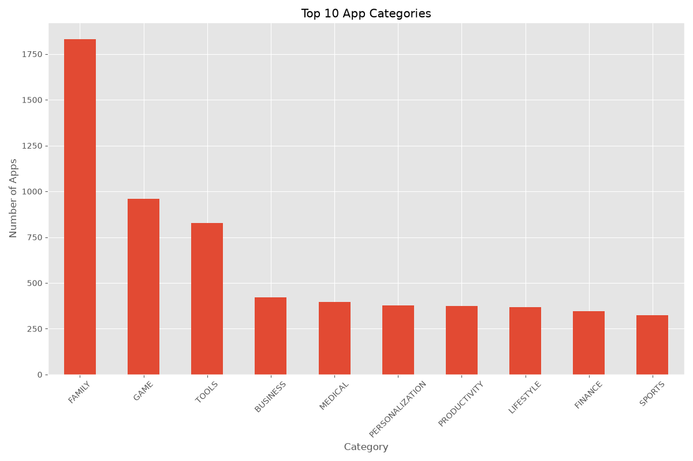
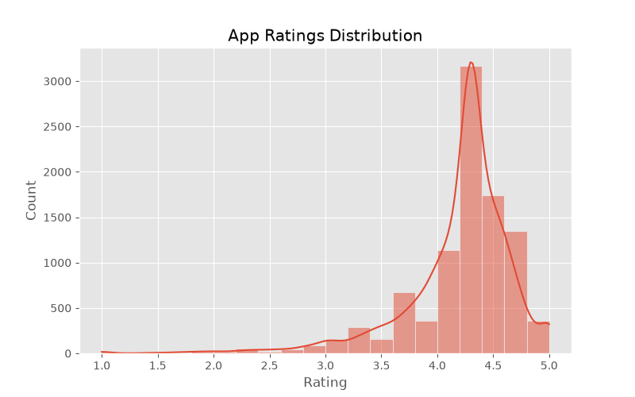
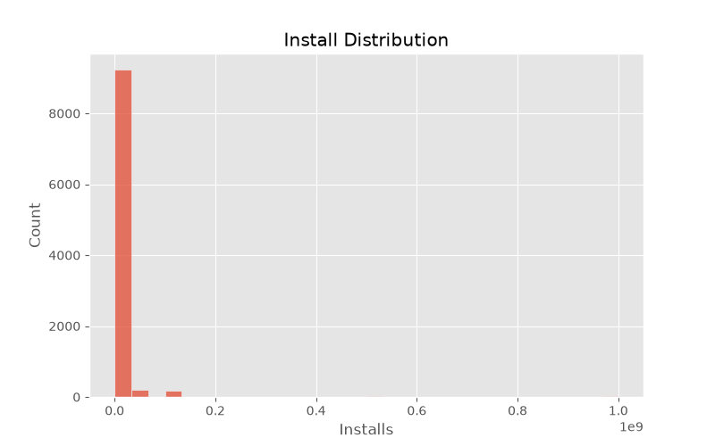
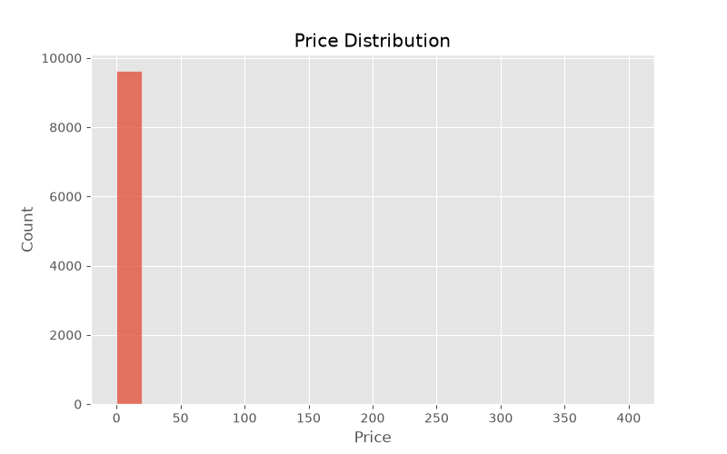
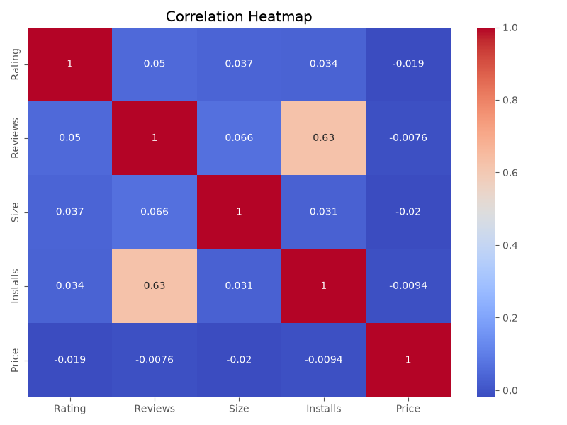
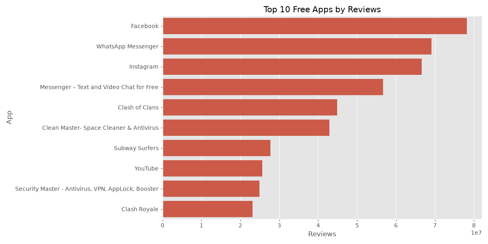
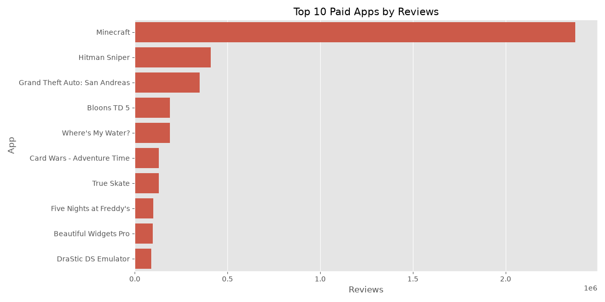
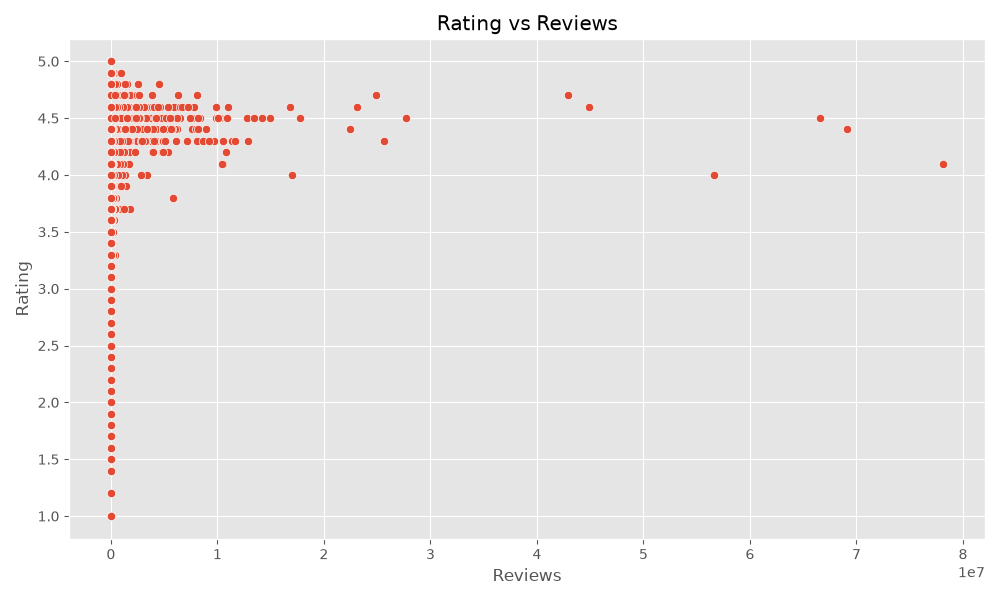
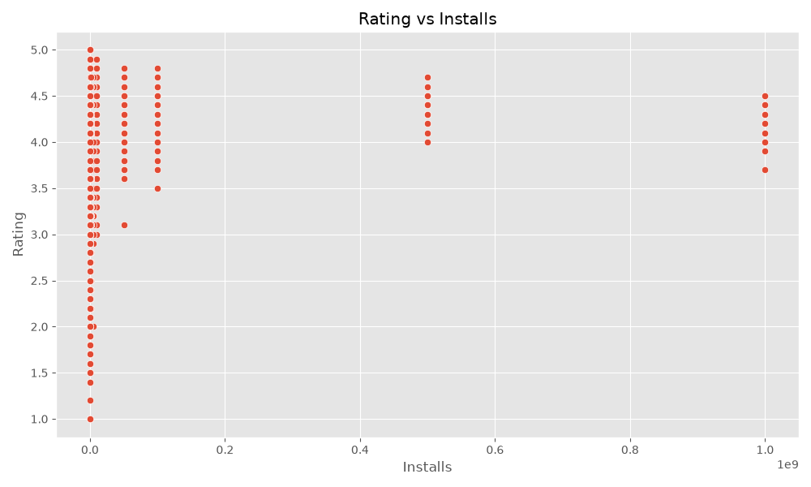

# 📱 Google Play Store Data Analysis

## 📌 Project Overview

This project analyzes Google Play Store applications to uncover market trends, user behavior, category popularity, app ratings, pricing patterns, and customer sentiments. The analysis combines exploratory data analysis (EDA), visualization, and sentiment analysis to generate valuable business insights.

---

## 🎯 Objectives

- Clean and preprocess Google Play Store datasets.
- Analyze app categories and distribution.
- Explore ratings, installs, reviews, and pricing trends.
- Understand user sentiments from reviews.
- Generate visualizations for better interpretation.
- Extract actionable business insights and recommendations.

---

## 📂 Dataset

### Apps Dataset
apps.csv: https://www.kaggle.com/datasets/utshabkumarghosh/android-app-market-on-google-play
Contains:

- App Name
- Category
- Rating
- Reviews
- Size
- Installs
- Price
- Content Rating
- Genres
- Android Version

### User Reviews Dataset
user_review.csv: https://www.kaggle.com/datasets/utshabkumarghosh/android-app-market-on-google-play
Contains:

- App
- Translated Review
- Sentiment
- Sentiment Polarity
- Sentiment Subjectivity

**Dataset Source:**

Google Play Store Dataset

User Reviews Dataset

*(Datasets are excluded from this repository due to size constraints.)*

---

## 🛠 Technologies Used

- Python
- Pandas
- NumPy
- Matplotlib
- Seaborn

---

## 📊 Visualizations

### Category Distribution



### Ratings Distribution



### Install Distribution



### Price Distribution



### Correlation Heatmap



### Sentiment Distribution


### Top Free Apps



### Top Paid Apps



### Rating vs Reviews



### Rating vs Installs



---

## 🔍 Key Insights

- Family and Game categories dominate the Play Store.
- Most applications are free.
- Apps with higher ratings tend to receive more installs and reviews.
- Positive sentiment dominates user reviews.
- Price has little influence on app popularity.

---

## 💡 Recommendations

- Focus on maintaining ratings above 4.0.
- Improve user experience through regular updates.
- Monitor user sentiments to identify issues.
- Utilize free apps with ads and in-app purchases.
- Target high-demand categories for better reach.

---

## 📁 Project Structure

```text
kalyanreddy_task09/
│
├── google_play_store_analysis.py
├── README.md
├── requirements.txt
├── outputs/
│   ├── app_size_distribution.png
│   ├── average_rating_by_category.png
│   ├── category_distribution.png
│   ├── content_rating_distribution.png
│   ├── correlation_heatmap.png
│   ├── install_distribution.png
│   ├── price_distribution.png
│   ├── ratings_distribution.png
│   ├── rating_vs_installs.png
│   ├── rating_vs_reviews.png
│   ├── sentiment_distribution.png
│   ├── top_free_apps.png
│   └── top_paid_apps.png
```

---

## 🚀 Future Enhancements

- Interactive dashboards using Power BI or Tableau.
- Predict app success using machine learning.
- Topic modeling on reviews.
- Advanced sentiment analysis with NLP.

---

## 👨‍💻 Author

**Byreddy Kalyan Reddy**

B.Tech CSE (AI & DS)

Swami Vivekanandha Institute of Technology

GitHub: https://github.com/kalyan-ds

LinkedIn: https://www.linkedin.com/in/kalyan-reddy-byreddy-559b6b344

---