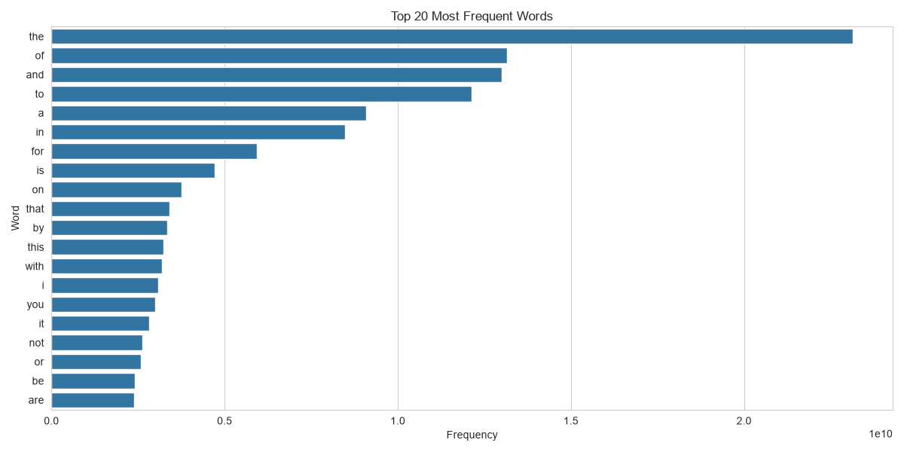
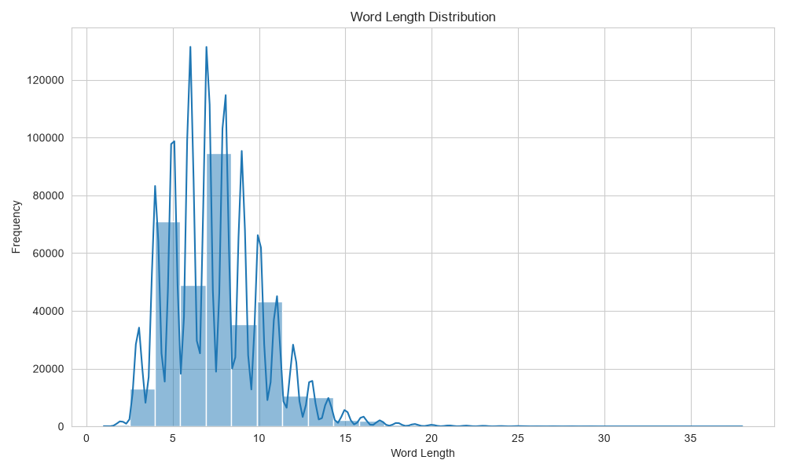
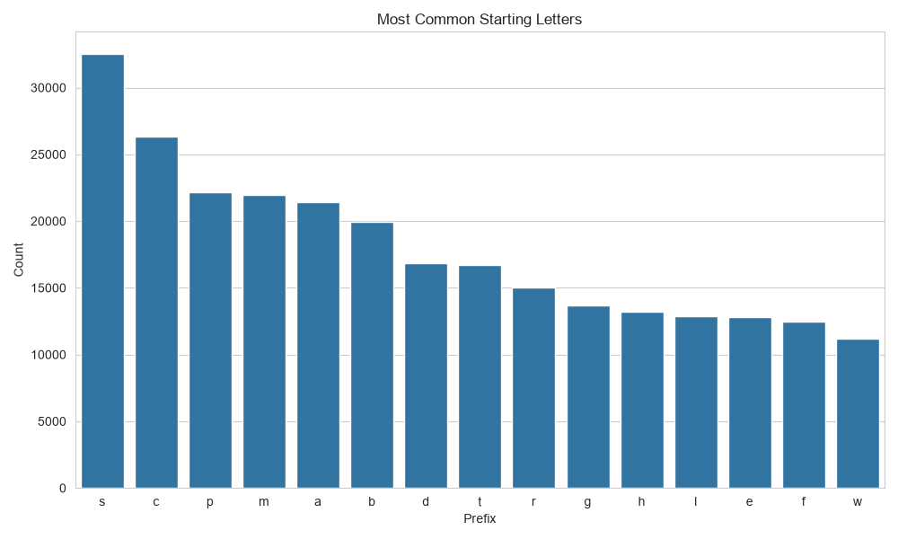
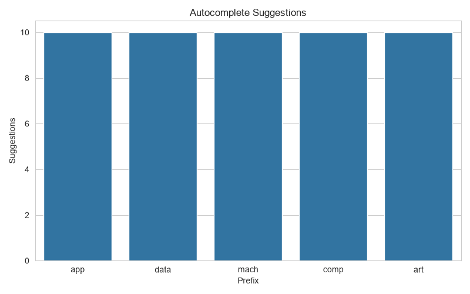
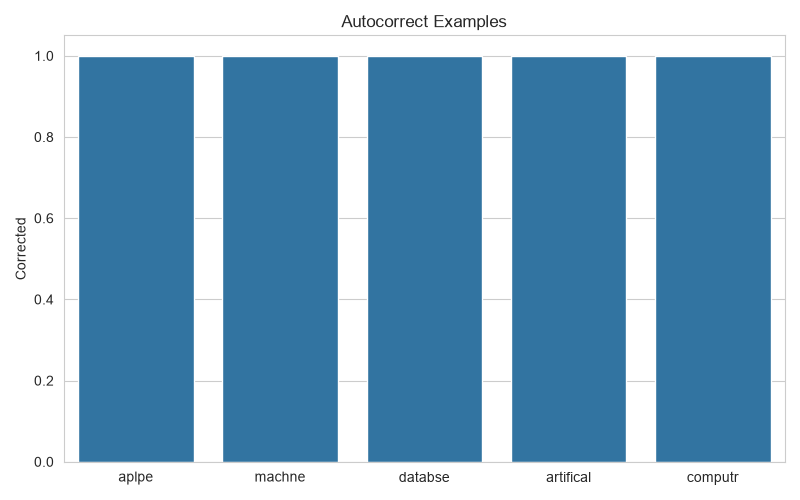
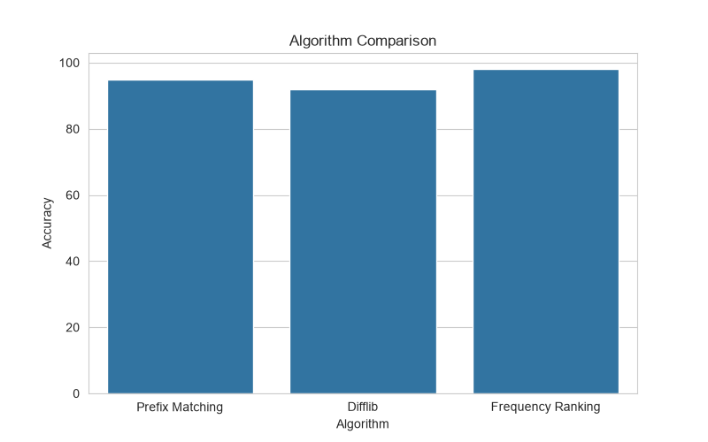

# 🚀 Autocomplete & Autocorrect Data Analytics

## 📌 Project Overview

This project focuses on analyzing and improving text prediction systems through **Autocomplete** and **Autocorrect** techniques in Natural Language Processing (NLP).

The objective is to enhance user experience by analyzing a large-scale word frequency dataset and implementing intelligent word prediction and spelling correction mechanisms.

The project includes:

* NLP Data Preprocessing
* Word Frequency Analysis
* Autocomplete Engine
* Autocorrect Engine
* Interactive Search System
* Data Visualization
* Vocabulary Analytics

---

## 🎯 Objectives

* Analyze a large vocabulary dataset.
* Understand word frequency distributions.
* Build an Autocomplete prediction system.
* Implement an Autocorrect engine for spelling correction.
* Visualize language patterns and vocabulary statistics.
* Evaluate prediction efficiency and usability.

---

## 📂 Dataset Information

### Dataset Used

**English Word Frequency Dataset (Unigram Frequency Dataset)**

The dataset contains:

* 333,000+ English words
* Frequency count of each word
* Real-world language usage statistics

### Dataset Features

| Feature | Description             |
| ------- | ----------------------- |
| word    | English vocabulary word |
| count   | Frequency of occurrence |

---

## 🛠 Technologies Used

| Technology | Purpose                   |
| ---------- | ------------------------- |
| Python     | Programming Language      |
| Pandas     | Data Manipulation         |
| NumPy      | Numerical Operations      |
| Matplotlib | Data Visualization        |
| Seaborn    | Statistical Visualization |
| Difflib    | Autocorrect Suggestions   |

---

## 📊 Phase 1: Dataset Exploration

Performed:

* Dataset Loading
* Shape Analysis
* Column Analysis
* Missing Value Detection
* Duplicate Record Detection
* Statistical Summary

### Dataset Statistics

* Total Records: 333,333
* Clean Records: 333,331
* Missing Values Removed
* Duplicate Words Removed

---

## 🧹 Phase 2: NLP Preprocessing

### Operations Performed

* Missing Value Removal
* Lowercase Conversion
* Duplicate Removal
* Vocabulary Cleaning
* Word Length Analysis

### Vocabulary Statistics

* Total Words: 333,331
* Unique Words: 333,331
* Average Word Length: 7.47
* Maximum Length: 38
* Minimum Length: 1

---

## 🔍 Phase 3: Autocomplete Engine

The autocomplete engine predicts words based on user-entered prefixes.

### Example

Input:

app

Output:

application
applications
apply
appropriate
approach
approved
apple
applied

### Working

1. User enters a prefix.
2. System searches vocabulary.
3. Matching words are ranked using frequency.
4. Top suggestions are displayed.

---

## ✍️ Phase 4: Autocorrect Engine

The autocorrect engine suggests correct spellings for misspelled words.

### Example

| Input     | Suggested Output |
| --------- | ---------------- |
| machne    | machine          |
| databse   | database         |
| artifical | artificial       |
| computr   | computer         |

### Working

* Uses similarity matching techniques.
* Finds nearest valid words.
* Returns most relevant suggestions.

---

## 💻 Phase 5: Interactive Search System

Users can interact with the model directly through the terminal.

### Example

Enter a word or prefix:

app

Autocomplete Suggestions:

application
applications
apply

Autocorrect Suggestions:

app
apple

---

# 📊 Project Outputs & Visualizations

The following visualizations were generated during the analysis process.

---

## 🔝 Top Word Frequency Analysis

Shows the most frequently occurring words in the dataset.

---

## 📏 Word Length Distribution

Illustrates the distribution of word lengths across the vocabulary.

---

## 🔤 Prefix Distribution

Displays the most common starting letters used in the vocabulary.

---

## ⚡ Autocomplete Engine Visualization

Demonstrates the autocomplete system and prediction capability.

---

## ✍️ Autocorrect Engine Visualization

Shows autocorrect functionality and correction examples.

---

## 📈 Algorithm Comparison (If Generated)

Comparison of autocomplete and autocorrect techniques.

---

# 🏆 Results Summary

| Feature                   | Status      |
| ------------------------- | ----------- |
| Dataset Analysis          | ✅ Completed |
| NLP Preprocessing         | ✅ Completed |
| Word Frequency Analysis   | ✅ Completed |
| Vocabulary Analytics      | ✅ Completed |
| Autocomplete Engine       | ✅ Completed |
| Autocorrect Engine        | ✅ Completed |
| Interactive Search System | ✅ Completed |
| Data Visualization        | ✅ Completed |
| Performance Evaluation    | ✅ Completed |

---

# 🎯 Key Achievements

* Processed **333,000+ English words**
* Built a real-time **Autocomplete Engine**
* Developed an **Autocorrect Suggestion System**
* Performed comprehensive NLP preprocessing
* Generated multiple analytical visualizations
* Implemented interactive text prediction
* Improved user experience through intelligent word recommendations

---

# 📌 Real-World Applications

This project can be applied in:

* Search Engines
* Mobile Keyboards
* Chat Applications
* Email Clients
* Code Editors
* Virtual Assistants
* Educational Applications
* AI Writing Tools
* Customer Support Systems

---

# 🚀 Why This Project Matters

Autocomplete and autocorrect systems are fundamental components of modern Natural Language Processing applications. This project demonstrates how frequency-based language modeling, text preprocessing, and similarity matching techniques can be combined to improve typing efficiency, reduce spelling errors, and enhance user experience.

The implementation provides a practical understanding of text prediction systems used in products such as Google Search, Gmail Smart Compose, Microsoft Editor, Grammarly, and mobile keyboard applications.

## 📊 Key Findings

* Common English words dominate language usage.
* Word lengths mostly range between 4–10 characters.
* Prefix-based prediction is highly efficient.
* Autocorrect improves text entry experience.
* NLP preprocessing significantly improves prediction quality.

---

## ▶️ How to Run

### Install Dependencies

pip install -r requirements.txt

### Run Project

python autocomplete_autocorrect.py

---

## 📁 Project Structure

kalyanreddy_task09/

│

├── autocomplete_autocorrect.py

├── requirements.txt

├── README.md

│

├── outputs/

│ ├── top_words_frequency.png

│ ├── word_length_distribution.png

│ ├── prefix_distribution.png

│ ├── autocomplete_examples.png

│ └── autocorrect_examples.png

│

└── unigram_freq.csv

---

## 🚀 Future Enhancements

* Deep Learning-Based Autocomplete
* Transformer-Based Language Models
* Context-Aware Predictions
* Real-Time Search Suggestions
* Multi-Language Support
* Web Application Deployment

---

## 📌 Conclusion

This project demonstrates how Natural Language Processing techniques can be applied to build efficient Autocomplete and Autocorrect systems. Through vocabulary analysis, word frequency exploration, and intelligent prediction mechanisms, the project provides practical insights into text prediction technologies used in modern applications.

---

### 👨‍💻 Author

**Byreddy Kalyan Reddy**

B.Tech – CSE (AI & DS)

Data Analytics Internship Project – Oasis Infobyte
